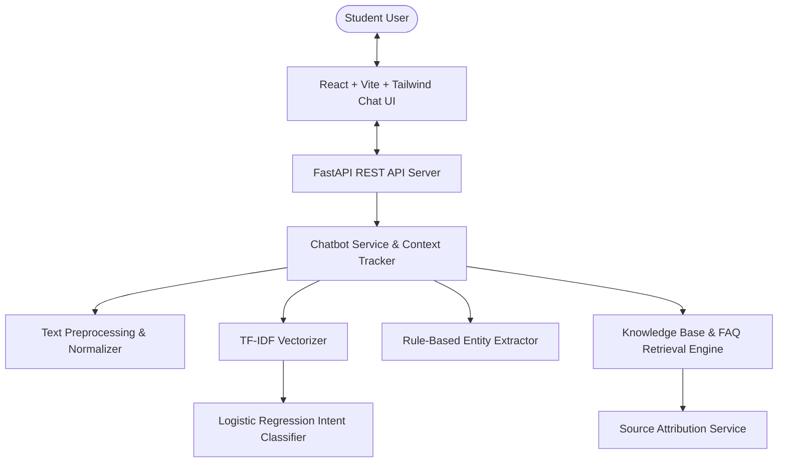
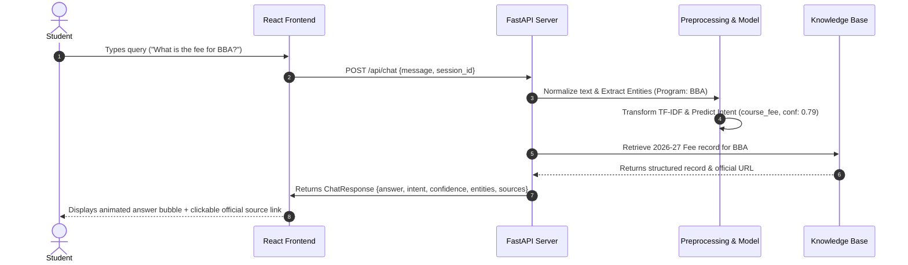
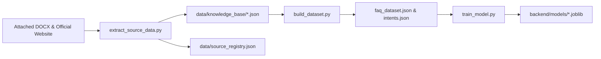

# System Architecture & Data Flow — Kalinga University AI Chatbot

## High-Level System Architecture

```mermaid
flowchart TD
    Student([Student User]) <--> ReactUI[React + Vite + Tailwind Chat UI]
    ReactUI <--> FastAPI[FastAPI REST API Server]
    FastAPI --> ChatEngine[Chatbot Service & Context Tracker]
    ChatEngine --> Preproc[Text Preprocessing & Normalizer]
    ChatEngine --> TFIDF[TF-IDF Vectorizer]
    TFIDF --> Classifier[Logistic Regression Intent Classifier]
    ChatEngine --> Entity[Rule-Based Entity Extractor]
    ChatEngine --> KB[Knowledge Base & FAQ Retrieval Engine]
    KB --> Sources[Source Attribution Service]
```

## Detailed Data Processing Flow

```mermaid
sequenceDiagram
    autonumber
    actor Student
    participant UI as React Frontend
    participant API as FastAPI Server
    participant NLP as Preprocessing & Model
    participant KB as Knowledge Base
    
    Student->>UI: Types query ("What is the fee for BBA?")
    UI->>API: POST /api/chat {message, session_id}
    API->>NLP: Normalize text & Extract Entities (Program: BBA)
    NLP->>NLP: Transform TF-IDF & Predict Intent (course_fee, conf: 0.79)
    API->>KB: Retrieve 2026-27 Fee record for BBA
    KB-->>API: Returns structured record & official URL
    API->>UI: Returns ChatResponse {answer, intent, confidence, entities, sources}
    UI-->>Student: Displays animated answer bubble + clickable official source link
```

## Knowledge Base Extraction Pipeline

```mermaid
flowchart LR
    DOCX[Attached DOCX & Official Website] --> ExtractionScript[extract_source_data.py]
    ExtractionScript --> KBFiles[data/knowledge_base/*.json]
    ExtractionScript --> Registry[data/source_registry.json]
    KBFiles --> DatasetScript[build_dataset.py]
    DatasetScript --> Processed[faq_dataset.json & intents.json]
    Processed --> Trainer[train_model.py]
    Trainer --> Models[backend/models/*.joblib]
```
