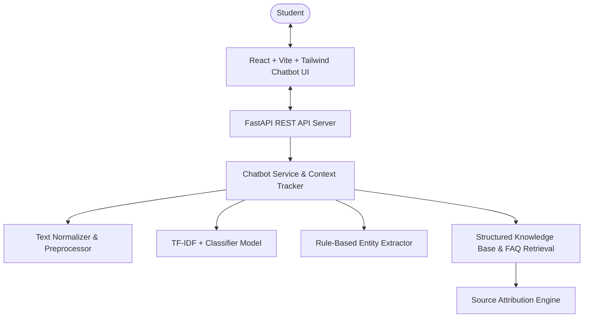

# Implementation Plan — Kalinga University AI Student Query Chatbot

The goal of this project is to build an intelligent, explainable NLP-based student query chatbot for Kalinga University, ready for a college minor-project demonstration. The chatbot will answer student queries about admissions, courses, fees, scholarships, internships, placements, and campus facilities using a structured knowledge base derived strictly from the official Kalinga University document and website.

## User Review Required

> [!IMPORTANT]
> - **Source Grounding & Zero Hallucination**: The system will enforce strict facts from the provided source document (`Kalinga_University_Admission_Fees_Courses_Internships_Placements_Analysis_2026-27.docx`). Information not present (e.g. non-Arts fee tables dynamically loaded on the site) will return an explicit, helpful fallback urging the user to check the official fee portal rather than inventing fake numbers.
> - **Explainable Lightweight Stack**: As specified, the application uses **scikit-learn (TF-IDF + LogisticRegression/LinearSVC)** for intent classification and pattern retrieval without any external paid LLM dependency.
> - **Current vs. Historical Data**: Placement examples (e.g., ₹33 LPA for LLM at Cornerstone) are presented as individual published achiever highlights, and historical brochure statistics (₹10 LPA max, ₹2.30 LPA avg) are tagged with `status: "historical"`.

---

## Proposed System Architecture & File Structure



### File Hierarchy

```
d:\Kalinga University AI Chatbot\
├── AGENTS.md
├── README.md
├── .env.example
├── .gitignore
├── .agents/
│   ├── rules/
│   │   ├── project-quality.md
│   │   ├── data-integrity.md
│   │   ├── testing.md
│   │   ├── frontend.md
│   │   └── backend.md
│   └── skills/
│       ├── dataset-extraction/SKILL.md
│       ├── kalinga-knowledge-base/SKILL.md
│       ├── nlp-chatbot/SKILL.md
│       ├── browser-qa/SKILL.md
│       └── project-documentation/SKILL.md
├── data/
│   ├── raw/
│   ├── processed/
│   │   ├── faq_dataset.json
│   │   ├── faq_dataset.csv
│   │   └── intents.json
│   ├── knowledge_base/
│   │   ├── university.json
│   │   ├── admissions.json
│   │   ├── courses.json
│   │   ├── fees.json
│   │   ├── scholarships.json
│   │   ├── internships.json
│   │   ├── placements.json
│   │   └── campus.json
│   └── source_registry.json
├── scripts/
│   ├── extract_source_data.py
│   ├── build_dataset.py
│   ├── train_model.py
│   └── evaluate_model.py
├── backend/
│   ├── requirements.txt
│   ├── models/
│   │   ├── tfidf_vectorizer.joblib
│   │   ├── intent_classifier.joblib
│   │   └── label_encoder.joblib
│   ├── app/
│   │   ├── main.py
│   │   ├── config.py
│   │   ├── schemas.py
│   │   ├── api/
│   │   │   ├── chat.py
│   │   │   ├── health.py
│   │   │   └── knowledge.py
│   │   ├── nlp/
│   │   │   ├── preprocessing.py
│   │   │   ├── classifier.py
│   │   │   ├── entity_extractor.py
│   │   │   └── trainer.py
│   │   └── services/
│   │       ├── chatbot.py
│   │       ├── retrieval.py
│   │       ├── response_generator.py
│   │       └── source_service.py
│   └── tests/
│       ├── test_api.py
│       ├── test_nlp.py
│       ├── test_safety.py
│       └── test_context.py
├── frontend/
│   ├── package.json
│   ├── vite.config.ts
│   ├── tailwind.config.js
│   ├── postcss.config.js
│   ├── tsconfig.json
│   ├── index.html
│   └── src/
│       ├── App.tsx
│       ├── main.tsx
│       ├── index.css
│       ├── components/
│       │   ├── Header.tsx
│       │   ├── ChatWindow.tsx
│       │   ├── MessageBubble.tsx
│       │   ├── InputBar.tsx
│       │   ├── SuggestedQuestions.tsx
│       │   ├── SourceCard.tsx
│       │   └── KnowledgeModal.tsx
│       ├── services/
│       │   └── api.ts
│       └── types/
│           └── chat.ts
└── docs/
    ├── project-report.md
    ├── architecture.md
    ├── dataset.md
    └── testing.md
```

---

## Detailed Step-by-Step Implementation Plan

### Phase 1: Environment & Setup
1. Initialize Python virtual environment `.venv` and install `fastapi`, `uvicorn`, `pydantic`, `scikit-learn`, `pandas`, `numpy`, `python-docx`, `joblib`, `pytest`, `httpx`.
2. Initialize Frontend using Vite + React + TypeScript + Tailwind CSS in `frontend/`.

### Phase 2: Data Extraction & Knowledge Base Construction
1. Create `scripts/extract_source_data.py` to parse `Kalinga_University_Admission_Fees_Courses_Internships_Placements_Analysis_2026-27.docx`.
2. Extract all key sections: Snapshot, Admissions, KALSEE/KAL-MAT, Scholarships, Courses, 2026-27 Fee Table, Internships, Placements (Individual & Historical), Recruiters, and Official URLs.
3. Populate structured JSON files under `data/knowledge_base/` and `data/source_registry.json`.
4. Create `scripts/build_dataset.py` to generate `intents.json`, `faq_dataset.json`, and `faq_dataset.csv` with 15–30 high-quality training patterns per intent across 30+ intents.

### Phase 3: NLP Pipeline & Model Training
1. Implement text normalization, lemmatization/lowercasing, entity extraction (programs: BBA, MBA, B.Tech, MCA, LLM, B.Pharm; entrance exams: KALSEE, KAL-MAT; fee terms; placement terms).
2. Implement model trainer in `scripts/train_model.py` using `TfidfVectorizer` + `CalibratedClassifierCV(LinearSVC)` / `LogisticRegression`.
3. Save trained model artifacts (`tfidf_vectorizer.joblib`, `intent_classifier.joblib`, `label_encoder.joblib`) into `backend/models/`.
4. Implement confidence evaluation (threshold = 0.65) and fallback handling.

### Phase 4: Backend API Development (FastAPI)
1. Build endpoints:
   - `GET /api/health`
   - `POST /api/chat` (accepts query & optional session_id, returns response, intent, confidence, entities, source attribution)
   - `GET /api/intents`, `GET /api/courses`, `GET /api/fees`, `GET /api/scholarships`, `GET /api/internships`, `GET /api/placements`
2. Implement session context tracker (`last_intent`, `last_program`, `last_entity`) to support follow-up queries like *"What is BBA fee?"* followed by *"What about MBA?"* or *"Does it have placements?"*.

### Phase 5: Frontend UI Development (React + Tailwind CSS)
1. Build a clean, responsive student assistant UI:
   - Header with university branding, badge, and session reset.
   - Interactive Chat Area with animated message bubbles, timestamps, typing indicators, entity chips, and verified clickable source links.
   - Suggested query pills ("BBA Fee Structure", "Admission Procedure 2026-27", "Is KALSEE required?", "Highest Package & Recruiters", "Scholarships up to 100%").
   - Knowledge Base browser modal for students to explore structured fee tables, recruiter lists, and scholarship criteria.
   - Dark/Light aesthetic, mobile responsive layout (tested across 320px - 1440px).

### Phase 6: Automated Testing & Safety Audits
1. Pytest suite in `backend/tests/`:
   - `test_api.py`: Endpoint health, chat request/response validation, length protection.
   - `test_nlp.py`: Intent classification precision & recall on test queries.
   - `test_safety.py`: Ensure missing data returns safe fallbacks without inventing fees or guarantees.
   - `test_context.py`: Multi-turn query resolution test.

### Phase 7: Browser QA & Verification
1. Run backend server (`uvicorn app.main:app`) and frontend dev server (`npm run dev`).
2. Use browser testing to interactively verify:
   - Initial greeting & suggested questions.
   - Course, Fee, Admission, Scholarship, Internship, and Placement queries.
   - Multi-turn follow-up queries.
   - Out-of-scope query fallback handling.
   - Clickable source link targets.

### Phase 8: Documentation & Minor Project Report
1. Create `AGENTS.md` and `.agents/` rules and skills.
2. Produce comprehensive `README.md` with setup/run instructions.
3. Produce `docs/project-report.md` structured like a university minor project report (Abstract, Architecture, NLP Methodology, Results, Limitations, Future Scope).
4. Generate Mermaid diagrams in `docs/architecture.md`.

---

## Verification Plan

### Automated Tests
- `pytest backend/tests/`
- Model training & evaluation metrics output via `python scripts/train_model.py`.

### Manual & Browser Verification
- Open `http://localhost:5173` using browser agent.
- Execute full test suite of sample queries listed in Master Prompt (Section 85).
- Verify dark/light UI, responsive breakpoint rendering, and zero-console errors.
